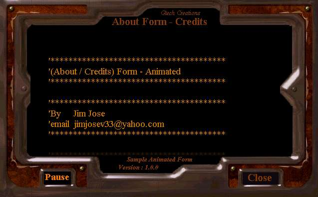



## \[ Animated / Fading \] \- \[ About / Credits \] \- Form

### Description

This is a sample About/Credit form with a nice fade effect. You can specify any background image and can set fade accordingly. You can also specify the Start/Mid/End fade color. You can edit the text by replacing the "*.txt" file in the app folder. If you like this please inform me. Kindly give me your Feedbacks/Comments. Good Luck!
 
### More Info
 

             |
---                |---
**Submitted On**   |2004-01-02 18:21:46
**By**             |[JJJJJJJJ](https://github.com/Planet-Source-Code/PSCIndex/blob/master/ByAuthor/jjjjjjjj.md)
**Level**          |Beginner
**User Rating**    |4.9 (181 globes from 37 users)
**Compatibility**  |VB 6\.0
**Category**       |[Graphics](https://github.com/Planet-Source-Code/PSCIndex/blob/master/ByCategory/graphics__1-46.md)
**World**          |[Visual Basic](https://github.com/Planet-Source-Code/PSCIndex/blob/master/ByWorld/visual-basic.md)
**Archive File**   |[\[\_Animated1842201202005\.zip](https://github.com/Planet-Source-Code/jjjjjjjj-animated-fading-about-credits-form__1-58396/archive/master.zip)

